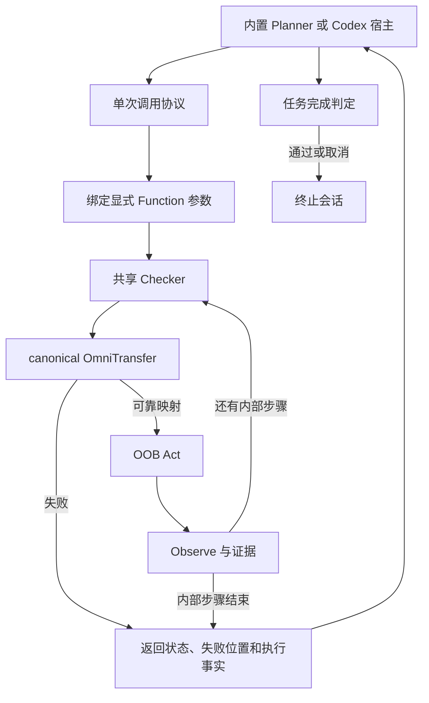

# OmniFlow 内核与 Harness 协议

2026-09-07；基线为 main 上的 `v1.0.0`（`30dcea39`）。本轮目标是把可变宿主从
已有执行内核中分离，保留论文的核心机制：从成功轨迹提取显式参数化 Function，
利用 canonical OmniTransfer 适应目标设备，每步观察并验证，失败交还 Agent。

设计权威是 `mobicom27_gui_agent/design.tex` 和 `implementation.tex`。本地 Skymark 的
`SYSTEM_ARCHITECTURE_CONTRACT.md` 仅用于指导局部测试：保存真实输入，在原有决策边界
比较修改前后结果，再运行短闭环和官方端到端验证；局部命中率不能替代任务成功率。
[Artemis](https://github.com/google/artemis) 仅作为执行反馈与进程生命周期测试参考：
区分动作派发前拒绝、派发失败和结果未知，由原宿主收到反馈后决策；测试真实 MCP
启动、关闭和标准输入输出隔离。两者都不替代 Function、canonical OmniTransfer 或
既有 AndroidWorld owner，也不引入第二个任务入口。

## 执行诊断（开发中）

AndroidWorld 的公共 `agent.step` 适配器创建执行账本，所有 method/Harness 使用同一
计时边界；重置任务时重置账本，抛出异常的 step 也保留时间。RunLog 的
`diagnostics.wall_accounting` 使用 `omniflow.wall-accounting.v1`：
`covered_wall_ms` 是被 span 覆盖的时间，`accounted_wall_ms` 是各 component 的
`exclusive_ms` 之和，两者应相等。`inclusive_ms` 包含子调用，不可相加。
并行叶节点重叠的部分归入 `concurrent`，不重复归给两方。
独立 SDK 的 `arecall`、`aexecute_function`、`acall_tool` 和 `arun` 也在共同调用
边界创建账本，返回 `detail.wall_accounting`；已有外层任务账本时直接复用，避免嵌套
调用各自重新统计。SDK 范围是内核调用，不包含 MCP 序列化或宿主进程启动。

当前拆分包括 Router/Planner、Recall、page encoding、Transfer、共享/插件 Checker、
Host act、普通/稳定/动作后观察、完成检查和证据写入。Transfer 在共同调用边界计时，
自定义 adapter 也计入。`host.external_unattributed` 是外部 CLI 中尚未拆开的时间，
不能当作纯模型推理耗时；`execution.other` 是其他执行工作。

内置模型进一步记录 `model.planner.request_until_response`（SDK 请求到返回响应）、
`model.planner.first_stream_event`（首个流事件）和 `model.planner.stream`（流消费）；
Router 记录 `model.router.request_until_response`。首事件不等于首 token，SDK 请求等待
包含网络与服务端工作，不能仅凭这些 span 再细分。流消费的 inclusive 包含首事件等待，
仍只对 exclusive 求和；超时请求也保留 failed_calls 和耗时。

内置 Harness 可通过 `RuntimeSettings(planner_error_retries=N)` 启用请求恢复。
默认 0 保持正式策略；N 必须为 0–3 的整数，是整个任务共享的额外重试预算。
仅连接错误和超时可重试，参数/模型权限错误不重试；失败调用照常计入用量，重试前
重新观察当前页面，不派发动作，也不重置 task deadline、步数或 Function 恢复状态。
`planner_diagnostics.request_retry_budget` 与 `request_retries` 记录预算、发生轮次和
错误类型。工厂 Harness 可配置此策略用于局部迭代，仍由原内置循环执行；正式入口不
增设任务专用重试参数。SDK transport timeout 仍最多 30 秒，完整任务最多 600 秒。

`diagnostics.lifecycle_wall_accounting` 使用同一 schema，但范围是既有 lifecycle
计时边界：`setup.harness`、`setup.agent_reset`、`setup.task_initialize`、
`lifecycle.execution`、`official_validator` 和 `lifecycle.other`。执行中的完成检查
只进入执行账本，不再计入 lifecycle 的最终官方 validator。两个账本分别对账，不能
相加。`owner_wall_ms` 保留现有计时器值，`owner_delta_ms` 为该值减 span 覆盖时间；
差额保留符号，不截零掩盖重复统计。进程启动及既有 lifecycle 之前的环境准备不在此范围。

Host 内进一步拆分 `oob.observe_rpc`、`oob.act_rpc`、`oob.retry_wait`、
`ui.app_ready` 与 `ui.stabilization.local`。RPC 包含传输和设备处理，设备端稳定采样
尚未独立拆分；只有 Python 端的显式等待可以计入 local stabilization。不得把整个
RPC 时长称为纯设备执行、纯网络或纯稳定等待。

AndroidWorld 的 `_TaskHost` 必须透传 `observe_stable` 和
`take_after_action_observation`，两者都经过同一状态标识/证据捕获逻辑。缓存后态必须
包含 recorder 的官方状态快照；缺少该快照时走普通 observe，不能传递不完整状态。
只在底层 Host 实现优化而漏掉包装层能力，会使稳定重试失效并重复观察。
稳定重试的 `ActionDecision` 同时携带实际用于映射的 Observation；共享执行和 Function
执行均使用它作为派发前状态，失败时也把该状态交还恢复流程，避免记录旧页面。
缓存后态的取用/规范化属于 `observe.post_action` 计时范围，并支持同步或异步 Host。

失败池使用 `omniflow.failure-pair.v1`，每次失败追加一条记录。`pair_id` 根据 source、
target 和 source action 内容计算，同一 pair 的 fast/stable/recall 尝试可以聚合。
`phase` 区分 `execute.fast`、`execute.stable`、`recall.entry`；原始坐标仅作为
source action 证据，不是目标动作。记录保存页面 hash/引用、有限候选（最多 8 个）、
数值分数和短原因；JSONL 不复制 XML、图片或大段上下文。`page_pair.complete` 仅表示
尝试时两边都有 XML。新增 `replay` 独立报告输入是否保存成功；`ready` 的相对路径指向
错误池旁 `<pool_stem>_assets/` 中的 gzip JSON manifest。失败输入单独按 SHA-256
寻址：完整 source/target Observation 压缩保存，截图去重保存，不复制整段 RunLog。
同一输入多次失败不重复写资产；每个 blob（含解压后 JSON/编码图片）上限 32 MiB。
资产缺失、过大或不可序列化时保留原失败，`replay.status=unavailable`，不伪造可回放输入。
这些诊断不改变原 Planner fallback，不作为运行时 Memory 来源。

源页面绑定校验失败也写入同一 pair 池，phase 为 `execute.source_binding`；目标绑定
失败仍属于 fast/stable 尝试。两者需要 Function 参数绑定上下文才能复现，不能仅凭
Action 和页面送入 mapper 声称回放了原错误，因此标记
`replay.status=unavailable, reason=preprocessing_context_required`，只留紧凑 pair。
此记录不执行动作、不改变失败返回或 Planner 恢复顺序。

局部回放只接受一个明确的 manifest，不扫描历史、不派发设备动作：

```python
import asyncio
from omniflow.transfer.failure_inputs import replay_failure_inputs

result = asyncio.run(replay_failure_inputs("/absolute/pairs_assets/<sha256>.json.gz"))
```

它默认调用原 canonical Transfer，经同一个 `attempt_transfer` 边界返回结果；测试候选
adapter 时可显式传 `transfer=callable`，不创建第二个 mapper。加载校验所有资产 hash，
原截图删除后仍能从保存的输入恢复。它只复现映射决定，不证明目标点正确或 task 成功。
自定义 mapper 的代码、模型和外部配置仍需由调用方固定；该 manifest 不打包依赖环境。
失败 pair 没有已确认的 target 标签，不能直接进入要求双向正确对应的 `TransferPairStore`。

新执行证据的 `metadata.transfer.transfer_attempts` 显式保存每次 fast/stable 的
`mapped` 布尔值和原因。执行汇总按这些尝试计数：重试单独计一次，open_app/wait 等
未请求映射的动作是零次；映射成功后设备动作失败也不改写为映射失败。旧证据缺少这一
字段时仍走历史汇总兼容逻辑，不据此回填不存在的尝试。此处统计的是动作准备路径，
Recall admission 的调用另在执行账本 `transfer.calls` 和错误池 phase 中保留。

当前 `1.1.0.dev1` 将对外服务收敛为 **Function Recall + Function Execute**：
`omniflow_recall(task_id, goal, limit)` 调用 `OmniFlow.arecall`，
`omniflow_execute(session_id, request_id, function_id, arguments)` 调用同一执行内核。
`aexecute_function` 拒绝未注册的 Function，原始动作不能借此入口执行。MCP 默认仅有这
两个工具；取消由宿主控制通道或 SDK 负责，任务完成由宿主判断。dev0 的七工具接口已移除。

工厂 Harness 的最小接口是 `arun(HarnessContext)`。默认由宿主提供决策；需要委托原
内置 Planner/Router 时，显式声明 `requires_builtin_planner = True`。AndroidWorld
根据这一依赖声明创建 Planner，不根据模块名字猜测；自定义 Harness 的结果仍作为
独立接入证据归档，不变成正式模型结果。内核和 OOB Host 始终为同一实例。

同一逻辑任务复用 `task_id`，Recall 返回此次会话的 `session_id`。新的 `task_id` 明确
表示开始新任务；在途操作未结束时不能切换。旧 task id 被退役，旧 session id 不能重发
到新任务上。不能用更换 task id 绕过任务预算或未知副作用处置。

## 1. 一个任务只有一个外层循环



| 层 | Owner | 合同 |
|---|---|---|
| Function 作者与编译 | 既有 `compile_runlog_to_store` | 显式 stable/task_parameter/online_observation；v2 连续步骤不改 |
| 内核执行 | `runtime/execution.py`、`core.py` | 同一 Checker → Transfer → Act → Observe；映射失败绝不重放 source 坐标 |
| 内置任务 Harness | `runtime/builtin_harness.py`，由 `OmniFlow.arun` 委托 | 唯一内置 Planner/Router 循环；官方完成判定、预算、停止 |
| 对外核心 | `OmniFlow.arecall` / `aexecute_function` | 召回不 act；执行仅限注册的 Function，失败返回宿主 |
| 原始动作适配 | 既有 `acall_tool` / GUI-agent adapters | harness 的 OOB 原始动作接入，不进入两工具服务 |
| 会话 | `GuiAgentToolRuntime` | 同一控制预算、串行执行、请求去重、显式关闭和新任务 |
| 设备 | AndroidWorldHost / OobGuiAgentHost | 复用 OobControlClient；宿主决策与设备传输分别替换 |
| 证据 | 既有 recorder/state owner | 无损 PNG 内容寻址、紧凑索引、必要时才转 base64 |

AndroidWorld 保持原来的 shell → run_tasks → run_task → run_episode 链；MCP 是外部
宿主的传输接口，不能作为第二个 AndroidWorld 实验 runner，也不能替换官方 validator。

## 2. 本轮找到的问题与修改

1. **双重循环。** 外部 `acall_tool` 原本复用会自动 fallback 的任务循环。外部 Agent
   等待工具返回时，内部 Planner 又继续执行，控制权和失败语义混乱。现在单次调用与
   `arun` 分开，但共用原来的 `execute_function`，没有复制 Function 内核。
2. **Router 无步数消耗。** 只有 Planner 分支增加运行步数，Router 成功、页面变化重试
   可重复绕过该限制。现在每轮都消耗同一预算；相同页面、参数和决策最多允许三次，
   第四次返回 `no_progress`。这是一条保守的停止规则，不证明任务不可能继续。
3. **完成判定不统一。** 原始动作路径的 `finished` 和 Function 完成分支有不同处理。
   现在内置 Harness 统一调用当前任务 checker；通过立即终止，checker 出错立即返回
   `verifier_error`，不会为了“修正页面”盲目追加动作。无 checker 的完成声明保持未验证。
4. **阻塞取消与预算重置。** 同步模型/OOB 调用阻塞事件循环，外部每次调用缺少共享预算。
   现在同步 I/O 进入工作线程，当前会话共享不超过 600 秒的 deadline；模型 HTTP 请求
   不超过 30 秒且受剩余预算约束。取消阻止下一次 dispatch，已发出的动作先收尾。
5. **不明确的失败可能被重试。** 已 dispatch 的动作若无法确认结果，返回 `effect_unknown`
   并关闭会话；映射失败则返回明确的未 dispatch 事实。两者不得混为“可安全重放”。
6. **重复截图和错误的后态引用。** Host/recorder 重复生成截图，索引长期保存完整观察；
   Fast Pass 还读取了不存在的 Host 属性。现在共享一次捕获、引用 recorder 的当前后态，
   相同 PNG 用同一 SHA-256 文件，索引仅保存引用。原图尺寸、source 状态和动作序列不改。
7. **核心导入依赖实验目录。** 独立 wheel 安装后，`import omniflow` 会读取未分发的
   `config/paper_androidworld.json` 而失败。实验配置读取现已移回 `src/experiment/protocol.py`，
   核心采用通用默认值；AndroidWorld owner 仍显式传入自己的协议预算。

以上是代码证据和回归结果；**全部行为修复仍待真机验证**，不能据此宣称用户问题已验收。

## 3. 一次调用反馈 v1

机器 schema：`schemas/omniflow_invocation.v1.json`。反馈分为四种独立事实：

- `execution`：本次 Function/动作是否完成，实际成功动作数，失败步骤，以及失败动作
  是否已经 dispatch；`next_step_index` 是位置证据，不是授权重放的 resume token。
- `observation`：最新页面、原始 display、截图引用；不在历史上下文重复携带 base64。
- `task.status`：`unknown` / `verified_success` / `verified_incomplete` / `verifier_error`。
  Function 成功不自动变成 task 成功。
- `control`：交还 `host` 或 `stop`，附明确原因；`automatic_retry` 永远为 false。

外部模式由宿主判断下一步。Function 部分成功后，宿主读取失败位置与当前状态，执行
必要的恢复动作或改用当前页面的原始动作。v1 **没有对外持久化 resume API**，不能仅凭
失败 index 重发整个 Function；内置续执行仍走原有 owner，并禁止续执行时改变绑定参数。

## 4. 生命周期、并发与重试

外部会话首次 observe/execute 时开始计时；一个任务中的多次调用不重置 600 秒预算。
关闭后只能显式开始新任务。`cancel`、完成、预算用尽或未知副作用都不允许追加动作。
不同层的控制对象通过 ContextVar 共享；Checker trigger budget 也跨本会话调用共享。

`execute_request(session_id, request_id, tool_name, arguments)` 对当前进程内、当前会话
的传输重试去重：同一 id 和参数返回原结果；同一 id 不同参数报冲突；正在执行或未获知
结果的 id 返回明确状态。每会话最多 128 个请求，缓存紧凑结果，不无限积累完整 trace。
进程重启后 session id 改变，旧请求不能续接。协议不承诺跨进程 exactly-once。

宿主中断可能只产生通用工具错误，甚至没有返回 invocation。此时副作用未知，不能
根据“工具被拒绝”或 CLI 退出码推断零动作。2026-09-07 的真实 CLI 测试中，Codex
中断后没有 execute 返回，Claude 返回通用拒绝消息；两者的首步 open_app 都已完成。
恢复前必须通过宿主观察通道核验当前设备，无观察能力则报告未知并停止；不能盲目
重发 Function 或换 task_id 绕过未知副作用。原始事实与测试范围见 MCP 接入文档。

同一 runtime 同时只执行一个 observe/act/Function；并发调用返回 busy。
取消是协作式的：不会撤回已经发生的点击，也不会在旧调用仍运行时把设备锁交给下一调用。
OOB/模型传输有 timeout；任意第三方插件若永久卡住，Python 线程不能被安全强杀。
正式 AndroidWorld 的 lifecycle deadline 仍由既有外层 owner 强制实施。

## 5. 截图与经验保留

截图保存在原证据目录的 `observations/objects/<sha256>.png`，并发写入只发布完整文件。
相同编码内容复用一份文件；像素不同的页面不做感知去重。当前后态和完整 source 状态
仍保留原始分辨率，避免损害 Transfer。模型传输只发送当前一张图；长期历史保存引用。
这降低重复磁盘写入和 Python 对象保留，尚未测量真机 RSS 或整个系统的加速比例。

历史清理仅作用于本地 `data/androidworld/.archive`。首轮删除约 16.72 GB，保守保留
731 个引用/经验文件。用户随后授权清空历史目录：确认唯一现存引用是过时的 result
registry 搜索根；TasksDueNextWeek 的归档轨迹与正常目录中的轨迹在路径归一化后相同，
截图逐字节一致，并非真正独有的经验。因此移除旧搜索根并删除剩余 790 个文件（含重建
的 Finder 元数据，约 11.41 MB），整个 `.archive` 目录已删除。当前经验没有被改写。
两阶段清单、原始时间和 SHA-256 日志分别在 `data/runtime/archive_cleanup/20260907/`
与 `20260907-final/`；审计属于本地数据，不提交 Git。

## 6. 跨设备与 Codex 接入边界

Function、bindings、source states 和 OmniTransfer 不依赖宿主的 Planner prompt。
宿主通过同一反馈协议更换，设备通过 Host 合同更换；两种变化不应互相牵连。
当前真正实现的设备适配是 Android OOB；不能把接口可插拔表述为已经完成 iOS/Windows
跨平台 Transfer。新增设备必须提供真实 Observe/Act/状态与坐标语义，并验证映射模型覆盖。

两工具服务不是完整的 Android Agent。需要原始动作 fallback 的宿主必须另有适用于当前
设备的动作通道，并协调同一设备 owner。Codex 自带桌面 CUA 不能被默认为 Android
动作通道；缺少该能力时，Function 失败必须交还宿主或报告阻塞，不能暗中恢复内置 Planner。

Codex 可通过 MCP 调用 Android OOB，而 Codex 自带 computer use 处理其支持的桌面。
两者由 Codex 宿主协同，不接管或替换 Codex 的私有 CUA 后端。Codex 主观上响应快不等于
已经证实某个内部组件更快；要比较同任务、设备、参数、模型与 endpoint 的 Memory ON/OFF，
分别记录模型、recall、Transfer、OOB、stabilization、checker、fallback 的耗时。

## 7. 验收与后续顺序

先验证取消等待中的模型/动作、重复取消、预算到期、成功后零新增动作、Function 部分失败、
请求重发、会话重启和相同页面重复决策；再做同任务 Memory OFF/ON 的交替真机测试。
记录设备、APK 版本、动作、结果、重启恢复与证据路径。没有真机不做已验收结论。

2026-09-07 补充联调已在 9207 的 `emulator-45562`（1440×3120）完成，使用已安装的
OOB 0.6.1 / versionCode 7。实际 OOB 截图和一个 wait 动作成功；重复 request id 没有
新增设备 I/O；取消后新动作被拒绝；新会话和未配置 verifier 的 finish 语义符合协议。
证据在 `data/runtime/validation/20260907-oob-protocol/`。这不是物理设备、Function
跨设备映射或模型性能验收，也不能将包含 SSH 传输的 smoke wall time 计入论文时延。

下一阶段的真机验收顺序与通过条件：

| 顺序 | 验证项 | 必须观察到的结果 |
|---|---|---|
| 1 | 模型等待与动作在途时取消、重复取消 | 收尾前不释放设备 owner，之后零新增动作；未知副作用明确报告 |
| 2 | Function 完成、checker 拒绝与异常 | 通过即停止；拒绝反馈宿主；异常不触发盲目纠正动作 |
| 3 | Transfer 失败与部分执行恢复 | 保留已执行前缀和当前页面，不重发前缀或 source 坐标 |
| 4 | 会话断开、重连与进程重启 | 同会话重发不重复动作；过期 session id 拒绝续接 |
| 5 | Memory OFF/ON 交替运行 | 同任务/参数/设备/seed/模型/endpoint，两组均通过官方验证才组成时延配对 |

以上真机项尚未验收。冻结配对设置后再采集结果，不为得到成功样本临时更换模型；
若模型权限、设备或 validator 不可用，保留环境失败证据并排除出有效时延配对。

性能结论保持现有论文合同：主文只用 paired official-success 的 `execution_duration_ms`，
完整系统必须纳入 Function 失败但 fallback 恢复成功的成本。当前还不能宣称完整系统更快。
下一阶段再根据组件计时决定是否需要独立可中断 worker、持久 resume 或新的设备后端；
避免在没有实测前引入第二套执行循环。
## 统一 AndroidWorld Harness 接口

局部迭代参考本地 SkyMark 的 `SYSTEM_ARCHITECTURE_CONTRACT.md`：真实保存状态上的
局部调用只能证明局部行为，候选必须返回相同运行入口做官方 E2E；缺少状态转移或
oracle 的样本保留 unknown，不能把局部通过率相乘当任务成功。版本由 Git commit
固定，测试输入显式传入，不复制 SkyMark 的 registry 或历史索引到运行时。

恢复 Checker 通过 `OmniFlowConfig.runtime.checker_enabled` 配置；AndroidWorld
统一入口使用 `--checker on|off`，独立 MCP 使用相同参数。默认 on。off 同时关闭
共享恢复规则和默认/自定义恢复 Checker，但不会关闭官方完成验证、参数校验、
OmniTransfer admission 或设备错误检查。结果 `runtime_policy.checker_enabled` 与
原有 checker trigger counts 一起保存；off 结果归档为 checker_ablation，不晋升为
默认论文结果。连接现有运行时的 MCP 字节桥不接受第二份 Checker 配置。

AndroidWorld `agent.step` 只调用 `TaskHarness.arun(HarnessContext)`；默认适配器调用
现有 `flow.arun`，CLI 适配器把同一 `flow` 的两工具服务交给外部宿主。其他宿主以
`package.module:factory` 接入这个接口，不复制 episode、Host 或 Function 执行。
统一入口是 `run_androidworld.sh run ... --harness builtin|codex|claude|package.module:factory`。

独立服务允许宿主显式开始新任务；在 AndroidWorld episode 内锁定一个逻辑任务，
新 task_id 不能重置预算或完成状态。注册的官方 checker 在 Function 成功后由共享
判定函数调用，通过则立即返回终止事实；没有 checker 的独立服务仍返回未知任务状态。
外部 CLI 的请求次数若未报告，RunLog 与 task result 保留 null，不能把宿主 turn 数
或工具数当作模型调用数。CLI 的接入结果不进入冻结模型的正式结果晋升。
